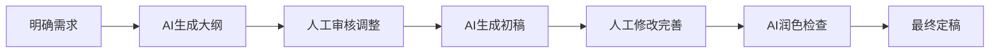

# AI 辅助写作

> "写作是一种探索，AI 是你的导航员。" —— 佚名

## 概述

AI 辅助写作是 Vibe Working 最核心的应用场景之一。通过与 AI 协作，你可以快速生成初稿、优化表达、检查语法、调整风格，将更多精力投入到创意构思和内容策划上。

## 核心价值

| 传统写作 | AI 辅助写作 |
|----------|-------------|
| 面对空白页面无从下手 | AI 生成初稿，快速启动 |
| 反复修改耗时耗力 | 一键优化表达 |
| 语法错误难以发现 | 自动检查语法 |
| 风格调整需要重写 | 快速调整语气风格 |
| 灵感枯竭 | AI 提供创意建议 |

## 写作场景分类

### 1. 商务写作

#### 邮件撰写

**场景**: 日常邮件、商务沟通、客户回复

**提示词模板**:

```markdown
请帮我写一封邮件，要求如下：
- 收件人：[客户/同事/领导]
- 主题：[邮件主题]
- 目的：[说明目的，如：请求、通知、感谢等]
- 语气：[正式/友好/紧急]
- 关键信息：[需要包含的要点]

示例：
请帮我写一封给客户的邮件，主题是项目进度汇报，语气要专业友好，
需要包含：1) 本周完成的工作 2) 下周计划 3) 需要客户确认的事项
```

**示例输出**:

```markdown
主题：【项目进度汇报】XX项目第三周进展

尊敬的XX总：

您好！

感谢您对项目的持续关注。现将本周项目进展汇报如下：

一、本周完成工作
1. 完成了核心功能模块的开发与测试
2. 优化了用户界面交互体验
3. 修复了测试反馈的3个关键问题

二、下周工作计划
1. 完成剩余功能模块开发
2. 进行系统集成测试
3. 准备项目验收材料

三、需要贵方确认的事项
1. 请确认附件中的界面设计稿是否满足需求
2. 请提供测试账号信息以便进行联调

如有任何问题，请随时联系。

此致
敬礼！

[你的名字]
[日期]
```

#### 方案报告

**场景**: 工作方案、项目报告、年度总结

**提示词模板**:

```markdown
请帮我撰写一份[类型]报告，包含以下内容：
- 背景：[项目/工作背景]
- 目标：[主要目标]
- 内容：[具体内容要点]
- 格式要求：[字数、结构等]

示例：
请帮我撰写一份年度工作总结报告，包含：
1. 年度工作回顾（3个重点项目）
2. 工作成果与亮点
3. 存在的问题与不足
4. 明年工作计划
字数约2000字，语气正式
```

---

### 2. 内容创作

#### 文章写作

**场景**: 公众号文章、博客、新闻稿

**提示词模板**:

```markdown
请帮我写一篇关于[主题]的文章，要求：
- 目标读者：[读者画像]
- 文章风格：[专业/轻松/故事性]
- 字数：[约XX字]
- 结构：[引言-正文-结尾]
- 核心观点：[要传达的主要观点]

示例：
请帮我写一篇关于"远程办公效率提升"的文章：
- 目标读者：职场白领，25-35岁
- 风格：实用、轻松、有案例
- 字数：约1500字
- 核心观点：远程办公需要建立新的工作习惯和自律机制
```

#### 文案撰写

**场景**: 产品文案、广告语、营销内容

**提示词模板**:

```markdown
请帮我为[产品/活动]撰写文案：
- 产品特点：[核心卖点]
- 目标用户：[用户群体]
- 文案风格：[简洁/情感/幽默]
- 使用场景：[应用场景]
- 字数要求：[XX字以内]

示例：
请为一款智能手表撰写产品文案：
- 特点：健康监测、运动追踪、长续航
- 目标用户：注重健康的年轻白领
- 风格：简洁有力
- 场景：电商详情页
- 字数：100字以内
```

---

### 3. 学术写作

#### 论文辅助

**场景**: 论文大纲、文献综述、研究方法

**提示词模板**:

```markdown
请帮我[任务]：
- 研究主题：[论文主题]
- 研究领域：[学科领域]
- 具体需求：[详细说明]

示例：
请帮我设计一篇关于"人工智能在教育领域应用"的论文大纲：
- 研究领域：教育技术学
- 论文类型：综述论文
- 要求：包含引言、文献综述、应用分析、挑战与展望、结论
```

#### 文献整理

**场景**: 文献摘要、研究现状梳理

**提示词模板**:

```markdown
请帮我总结以下文献的核心观点：
[粘贴文献内容或摘要]

要求：
1. 提取主要观点（3-5条）
2. 研究方法
3. 主要结论
4. 对本研究的参考价值
```

---

## 提示词技巧

### 1. 角色设定

让 AI 扮演特定角色，获得更专业的输出：

```markdown
# 写作专家角色
你是一位资深的[领域]写作专家，拥有10年以上的写作经验。
请帮我...

# 不同角色示例
- 你是一位专业的商务写作顾问...
- 你是一位资深的新媒体编辑...
- 你是一位学术论文写作导师...
- 你是一位品牌文案策划师...
```

### 2. 结构化输出

明确输出格式，让结果更易使用：

```markdown
# 表格格式
请用表格形式整理以下内容...

# 列表格式
请按以下格式输出：
1. xxx
2. xxx
3. xxx

# Markdown 格式
请使用 Markdown 格式输出，包含标题、列表、引用等...
```

### 3. 示例驱动

提供示例让 AI 理解你的期望：

```markdown
请参考以下示例风格，帮我写一段产品介绍：

示例：
"清晨的第一缕阳光，从一杯好咖啡开始。我们精选阿拉比卡咖啡豆，
采用中深度烘焙，为你带来醇厚而不苦涩的口感体验。"

请为[产品]写一段类似风格的介绍...
```

### 4. 迭代优化

通过追问逐步优化结果：

```markdown
# 第一轮
请帮我写一篇关于XX的文章...

# 第二轮
这篇文章太长了，请精简到1000字以内

# 第三轮
语气太正式了，请改得更轻松一些

# 第四轮
请增加一些实际案例
```

### 5. 风格调整

快速调整写作风格：

```markdown
# 正式风格
请将以下内容改写为正式的商务风格...

# 轻松风格
请将以下内容改写为轻松幽默的风格...

# 学术风格
请将以下内容改写为学术论文风格...

# 故事化
请用故事化的方式重新表达以下内容...
```

---

## 实用案例

### 案例 1：周报撰写

**需求**: 快速生成工作周报

**提示词**:

```markdown
请帮我写一份工作周报，包含以下内容：

本周完成：
1. 完成产品需求文档撰写
2. 参与3次项目评审会议
3. 修复线上2个紧急bug

下周计划：
1. 完成功能开发
2. 准备项目演示材料

遇到的问题：
- 需求变更频繁，影响进度

要求：格式规范，语气专业
```

**AI 输出**:

```markdown
## 本周工作总结

### 一、工作完成情况

1. **产品需求文档撰写**
   - 完成《XX功能需求文档》V1.0版本
   - 组织需求评审会议，收集反馈意见
   - 文档已归档至项目知识库

2. **项目评审会议**
   - 参与项目进度评审会议3次
   - 协调解决跨部门协作问题
   - 输出会议纪要并同步相关人员

3. **线上问题处理**
   - 修复用户登录异常问题
   - 解决数据导出格式错误问题
   - 问题响应时间均在SLA要求内

### 二、下周工作计划

1. **功能开发**
   - 启动XX功能模块开发
   - 预计完成核心功能80%

2. **项目演示准备**
   - 制作演示PPT
   - 准备演示环境
   - 预演并优化演示流程

### 三、问题与建议

**存在问题**：
- 需求变更频繁，导致开发计划调整
- 建议建立需求变更评估机制

**改进建议**：
- 增加需求评审环节
- 明确需求变更流程
```

---

### 案例 2：产品介绍文案

**需求**: 为一款新手机撰写产品介绍

**提示词**:

```markdown
请为一款新手机撰写产品介绍文案：

产品信息：
- 名称：星辰X5
- 特点：超薄设计（7.2mm）、5000mAh大电池、1亿像素相机、5G支持
- 目标用户：追求时尚和性能的年轻人
- 价格区间：3000-4000元

要求：
- 突出产品卖点
- 语言简洁有力
- 字数200字以内
- 适合电商详情页使用
```

**AI 输出**:

```markdown
**星辰X5 | 轻薄之上，实力非凡**

7.2mm 极致纤薄，5000mAh 澎湃电量，打破轻薄与续航的边界。
1亿像素超清影像，定格每一刻精彩瞬间。
5G 全速在线，畅享极速体验。

星辰X5，为追求极致的你而来。
```

---

### 案例 3：邮件改写

**需求**: 将口语化的邮件改写为正式商务邮件

**原始内容**:

```markdown
hi，那个项目的事，我们这边做得差不多了，你那边怎么样？
什么时候能给我们反馈？有点急，麻烦快点哈。
```

**提示词**:

```markdown
请将以下邮件改写为正式的商务邮件：

原始内容：
"hi，那个项目的事，我们这边做得差不多了，你那边怎么样？
什么时候能给我们反馈？有点急，麻烦快点哈。"

要求：
- 语气专业礼貌
- 结构清晰
- 表达紧迫但不失礼貌
```

**AI 输出**:

```markdown
主题：关于XX项目进展及反馈事宜

尊敬的XX：

您好！

关于XX项目，我方已基本完成既定工作内容。现就项目进展情况与您沟通如下：

一、我方工作进展
目前项目各项工作已接近尾声，核心功能模块已完成开发和测试。

二、需要贵方配合事项
为确保项目按时交付，恳请贵方尽快对已完成内容进行审核，并提供反馈意见。

三、时间安排
因项目交付时间较为紧迫，如蒙贵方在本周内给予反馈，将不胜感激。

如有任何问题，请随时联系。

此致
敬礼！

[你的名字]
[日期]
```

---

## 写作流程优化

### 传统流程 vs AI 辅助流程

| 阶段 | 传统流程 | AI 辅助流程 |
|------|----------|-------------|
| 构思 | 自己苦思冥想 | AI 提供创意建议 |
| 大纲 | 手动整理 | AI 生成框架 |
| 初稿 | 从零开始写 | AI 生成初稿 |
| 修改 | 反复修改 | AI 辅助优化 |
| 润色 | 逐字推敲 | AI 一键润色 |
| 检查 | 人工校对 | AI 语法检查 |

### 推荐工作流程



### 各阶段 AI 辅助要点

#### 1. 构思阶段

```markdown
# 获取创意
请为[主题]提供5个不同的写作角度...

# 头脑风暴
请列出关于[主题]的10个关键观点...

# 竞品分析
请分析以下几篇文章的写作特点：
[文章链接或内容]
```

#### 2. 大纲阶段

```markdown
# 生成大纲
请为[主题]的文章设计一个详细大纲...

# 优化结构
请优化以下文章大纲，使其更加逻辑清晰：
[现有大纲]
```

#### 3. 初稿阶段

```markdown
# 分段生成
请根据以下大纲，先写第一部分的内容...

# 扩写内容
请将以下要点扩写成完整的段落：
[要点列表]
```

#### 4. 修改阶段

```markdown
# 内容优化
请优化以下内容，使其更加[简洁/生动/专业]...

# 逻辑检查
请检查以下内容的逻辑是否通顺，并提出修改建议...

# 观点补充
请为以下内容补充更多论据和案例...
```

#### 5. 润色阶段

```markdown
# 语言润色
请润色以下内容，使其表达更加流畅...

# 风格调整
请将以下内容改写为[正式/轻松/学术]风格...

# 语法检查
请检查以下内容的语法错误并给出修改建议...
```

---

## 注意事项

### 适用场景

✅ **推荐使用**:

- 日常邮件、通知等常规写作
- 文章初稿生成
- 内容优化和润色
- 语法和表达检查
- 创意构思和头脑风暴
- 格式化和结构调整

⚠️ **谨慎使用**:

- 学术论文（需确保原创性）
- 重要商务文件（需人工审核）
- 涉及法律责任的文件
- 需要高度创意的作品

❌ **不建议使用**:

- 代写学术论文
- 涉及敏感信息的内容
- 需要完全原创的文学作品
- 涉及版权的商业内容

### 常见问题

#### 1. AI 生成内容太泛泛

**解决方案**:

```markdown
# 提供更多上下文
请结合以下背景信息撰写...
[详细背景]

# 要求具体细节
请在文章中加入具体的数据、案例、时间等细节...

# 指定风格和语气
请用[具体风格]来写，参考以下示例...
```

#### 2. 内容缺乏个性

**解决方案**:

```markdown
# 提供个人风格示例
请参考我之前的文章风格：
[示例文章]

# 加入个人观点
请在内容中加入以下个人观点：
[观点列表]
```

#### 3. 事实错误

**解决方案**:

```markdown
# 明确要求
请确保所有事实和数据准确，如有不确定的地方请标注...

# 人工核实
对 AI 生成的关键信息进行核实
```

### 最佳实践

1. **人机协作**: AI 生成初稿，人工把关质量
2. **迭代优化**: 通过多轮对话逐步完善
3. **保留原创**: 核心观点和创意来自人类
4. **核实信息**: 重要信息需人工核实
5. **风格一致**: 提供风格示例保持一致性

---

## 工具推荐

| 写作场景 | 推荐工具 | 特点 |
|----------|----------|------|
| 通用写作 | ChatGPT、Claude | 综合能力强 |
| 中文写作 | Kimi、文心一言 | 中文表达自然 |
| 长文写作 | Claude、Kimi | 长上下文支持 |
| 学术写作 | Claude、Perplexity | 逻辑严谨、可溯源 |
| 文案创作 | ChatGPT、豆包 | 创意丰富 |
| 语法检查 | Grammarly、ChatGPT | 专业语法校对 |

---

## 参考资料

- [OpenAI Writing Guide](https://platform.openai.com/docs/guides/writing)
- [Claude Writing Assistant](https://claude.ai)
- [Kimi 写作助手](https://kimi.moonshot.cn)
- 《写作的力量》- 威廉·津瑟
- 《非虚构写作课》- 简·耶格尔
