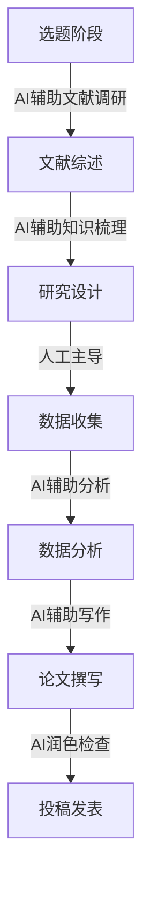

# AI 辅助研究

> "站在巨人的肩膀上，AI 让你站得更高。" —— 佚名

## 概述

AI 辅助研究是利用人工智能工具加速知识获取、文献调研、信息整理和学术写作的过程。通过 AI，研究者可以快速了解领域现状、梳理知识脉络、生成研究思路，大幅提升科研效率。

## 核心价值

| 传统研究方式 | AI 辅助研究 |
|--------------|-------------|
| 文献检索耗时 | AI 快速筛选相关文献 |
| 阅读理解慢 | AI 快速提炼核心观点 |
| 知识整理繁琐 | AI 自动生成知识图谱 |
| 写作效率低 | AI 辅助论文写作 |
| 信息分散 | AI 整合多源信息 |

## 主要应用场景

### 1. 文献调研

#### 快速了解领域现状

**场景**: 进入新领域时快速建立知识框架

**提示词模板**:

```markdown
请帮我了解[研究领域]的研究现状，包括：
1. 该领域的研究背景和意义
2. 主要研究方向和热点问题
3. 关键学者和代表性成果
4. 最新研究进展和发展趋势
5. 存在的主要挑战和未来方向

示例：
请帮我了解"大语言模型在教育领域应用"的研究现状...
```

#### 文献筛选与推荐

**场景**: 从海量文献中筛选相关研究

**提示词模板**:

```markdown
我正在研究[研究主题]，请帮我：
1. 推荐该领域的经典文献（5-10篇）
2. 推荐近3年的重要文献（5-10篇）
3. 说明推荐理由

示例：
我正在研究"人工智能辅助学习的个性化推荐算法"，请推荐相关文献...
```

#### 文献摘要与总结

**场景**: 快速理解文献核心内容

**提示词模板**:

```markdown
请帮我总结以下文献：
[粘贴文献摘要或全文]

总结要求：
1. 研究问题（Research Question）
2. 研究方法（Methodology）
3. 主要发现（Key Findings）
4. 研究贡献（Contributions）
5. 局限性（Limitations）
6. 对本研究的启示
```

---

### 2. 知识梳理

#### 概念解释

**场景**: 快速理解专业概念

**提示词模板**:

```markdown
请解释[概念名称]，要求：
1. 简明定义（一句话）
2. 详细解释（包含核心要素）
3. 相关概念对比
4. 实际应用场景
5. 学习资源推荐

示例：
请解释"Transformer架构"，要求适合初学者理解...
```

#### 知识图谱构建

**场景**: 梳理领域知识体系

**提示词模板**:

```markdown
请帮我构建[领域名称]的知识图谱，包括：
1. 核心概念及其关系
2. 主要理论流派
3. 研究方法体系
4. 应用领域
5. 发展脉络

请用层级结构或思维导图形式呈现。
```

#### 对比分析

**场景**: 对比不同理论、方法或技术

**提示词模板**:

```markdown
请对比分析[A]与[B]，从以下维度：
1. 基本原理
2. 优势
3. 劣势
4. 适用场景
5. 发展趋势

请用表格形式呈现对比结果。

示例：
请对比分析"监督学习"与"无监督学习"...
```

---

### 3. 研究设计

#### 研究问题提炼

**场景**: 从宽泛兴趣中提炼具体研究问题

**提示词模板**:

```markdown
我对[研究领域]感兴趣，想进行深入研究。
请帮我：
1. 分析该领域的研究空白
2. 提出3-5个潜在的研究问题
3. 评估每个问题的研究价值
4. 推荐最适合的研究方向

示例：
我对"在线教育效果评估"感兴趣，请帮我提炼研究问题...
```

#### 研究方法选择

**场景**: 选择合适的研究方法

**提示词模板**:

```markdown
我的研究问题是：[研究问题]
请帮我：
1. 推荐适合的研究方法（定量/定性/混合）
2. 说明推荐理由
3. 介绍具体的研究设计
4. 列出可能的数据收集方法
5. 指出潜在的挑战和解决方案
```

#### 研究框架设计

**场景**: 构建完整的研究框架

**提示词模板**:

```markdown
请帮我设计一个研究框架，研究主题是：[主题]
需要包含：
1. 研究背景与意义
2. 研究目标与问题
3. 理论基础
4. 研究假设（如适用）
5. 研究方法
6. 数据分析计划
7. 预期成果
```

---

### 4. 学术写作

#### 论文大纲生成

**场景**: 快速构建论文框架

**提示词模板**:

```markdown
请为以下研究设计论文大纲：
- 研究主题：[主题]
- 研究类型：[实证研究/综述/理论研究]
- 字数要求：[字数]
- 期刊要求：[期刊名称或格式要求]

示例：
请为"人工智能对大学生学习行为影响研究"设计论文大纲，
类型为实证研究，字数约8000字...
```

#### 文献综述撰写

**场景**: 整理和评述相关文献

**提示词模板**:

```markdown
请帮我撰写关于[主题]的文献综述，要求：
1. 时间范围：[年份范围]
2. 文献来源：[数据库/期刊]
3. 综述结构：
   - 引言（研究背景）
   - 主题1：[子主题]
   - 主题2：[子主题]
   - 主题3：[子主题]
   - 研究述评与展望
4. 字数：约[字数]

请基于以下文献信息撰写：
[粘贴文献列表或摘要]
```

#### 引言撰写

**场景**: 撰写论文引言部分

**提示词模板**:

```markdown
请帮我撰写论文引言，研究主题是：[主题]
需要包含：
1. 研究背景（说明研究的重要性）
2. 研究现状（简要回顾已有研究）
3. 研究空白（指出已有研究的不足）
4. 研究目的与意义
5. 论文结构

字数：约[字数]
```

#### 讨论部分撰写

**场景**: 分析研究结果的理论和实践意义

**提示词模板**:

```markdown
请帮我撰写论文的讨论部分：
- 研究问题：[问题]
- 主要发现：[发现1、发现2、发现3]
- 理论基础：[理论名称]

需要包含：
1. 研究发现的理论意义
2. 与已有研究的对话
3. 实践启示
4. 研究局限性
5. 未来研究方向
```

---

## 实用案例

### 案例 1：快速了解新领域

**需求**: 了解"教育人工智能"领域

**提示词**:

```markdown
请帮我快速了解"教育人工智能"领域，包括：
1. 定义与内涵
2. 发展历程
3. 主要研究方向
4. 关键技术
5. 应用场景
6. 挑战与机遇
7. 推荐进一步学习的资源
```

**AI 输出（节选）**:

```markdown
## 教育人工智能概述

### 1. 定义与内涵

教育人工智能（Artificial Intelligence in Education，AIED）是将人工智能技术
应用于教育领域，旨在提升教学效果、个性化学习体验和教育管理效率的交叉学科。

核心内涵包括：
- 智能教学系统
- 个性化学习推荐
- 教育数据分析
- 智能评估与反馈

### 2. 发展历程

| 阶段 | 时间 | 特点 |
|------|------|------|
| 萌芽期 | 1960s-1980s | 计算机辅助教学系统 |
| 发展期 | 1990s-2010s | 智能辅导系统兴起 |
| 爆发期 | 2010s-至今 | 深度学习驱动，应用多元化 |

### 3. 主要研究方向

1. **智能辅导系统（ITS）**
   - 自适应学习路径
   - 实时反馈与指导

2. **学习分析**
   - 学习行为建模
   - 学业预警系统

3. **自然语言处理应用**
   - 自动作文评分
   - 智能问答系统

...
```

---

### 案例 2：文献综述撰写

**需求**: 撰写"在线学习效果影响因素"文献综述

**提示词**:

```markdown
请帮我撰写关于"在线学习效果影响因素"的文献综述：

要求：
1. 时间范围：2015-2024年
2. 综述结构：
   - 引言
   - 学习者因素
   - 课程设计因素
   - 技术环境因素
   - 研究述评与展望
3. 字数：约2000字

主要文献发现：
- 学习者因素：自我效能感、学习动机、时间管理能力
- 课程设计：交互设计、内容呈现、评估方式
- 技术环境：平台易用性、网络稳定性、技术支持
```

**AI 输出（节选）**:

```markdown
## 在线学习效果影响因素研究综述

### 引言

随着互联网技术的快速发展和新冠疫情的推动，在线学习已成为重要的学习方式。
然而，在线学习效果存在显著差异，探究其影响因素对于提升在线教育质量具有重要意义。
本文综述了2015-2024年间相关研究，从学习者、课程设计和技术环境三个维度
分析在线学习效果的影响因素。

### 一、学习者因素

#### 1.1 自我效能感

研究表明，学习者的自我效能感是在线学习效果的关键预测因素。Zimmerman（2015）
的研究发现，高自我效能感的学习者在在线环境中表现出更强的学习坚持性和
更好的学业成绩。具体而言：

- 自我效能感影响学习者的目标设定
- 高自我效能感者更善于管理学习时间
- 自我效能感与学习满意度呈正相关

#### 1.2 学习动机

学习动机类型对在线学习效果有显著影响。Deci和Ryan的自我决定理论指出，
内在动机比外在动机更能预测学习投入度和学习成果...

### 二、课程设计因素

...

### 研究述评与展望

综合已有研究，未来研究可从以下方向深入：
1. 多因素交互作用研究
2. 纵向追踪研究设计
3. 技术发展带来的新影响因素
...
```

---

### 案例 3：研究问题提炼

**需求**: 从宽泛兴趣中提炼具体研究问题

**提示词**:

```markdown
我对"远程办公"这个话题很感兴趣，想进行学术研究。
请帮我：
1. 分析该领域的研究现状和空白
2. 提出5个潜在的研究问题
3. 评估每个问题的研究价值和创新性
```

**AI 输出**:

```markdown
## 远程办公研究领域分析与研究问题建议

### 一、研究现状与空白

#### 已有研究聚焦
- 远程办公对工作效率的影响
- 员工满意度与工作生活平衡
- 管理挑战与团队协作

#### 研究空白
1. 长期远程办公的职业发展影响
2. 不同行业的差异化研究
3. 技术工具对远程办公体验的影响机制
4. 跨文化视角的比较研究

### 二、研究问题建议

| # | 研究问题 | 研究价值 | 创新性 |
|---|----------|----------|--------|
| 1 | 远程办公对员工职业发展轨迹的长期影响研究 | ⭐⭐⭐⭐⭐ | ⭐⭐⭐⭐⭐ |
| 2 | 混合办公模式下团队信任构建机制研究 | ⭐⭐⭐⭐ | ⭐⭐⭐⭐ |
| 3 | 远程办公倦怠的影响因素与干预策略研究 | ⭐⭐⭐⭐⭐ | ⭐⭐⭐ |
| 4 | 不同代际员工远程办公适应性的比较研究 | ⭐⭐⭐⭐ | ⭐⭐⭐⭐ |
| 5 | AI工具对远程办公效率的影响机制研究 | ⭐⭐⭐⭐⭐ | ⭐⭐⭐⭐⭐ |

### 三、推荐研究方向

**推荐问题1：远程办公对员工职业发展轨迹的长期影响研究**

研究价值：
- 填补长期影响研究的空白
- 对企业和员工都有实践指导意义
- 可为远程办公政策制定提供依据

研究设计建议：
- 采用纵向追踪研究设计
- 结合定量问卷和定性访谈
- 跟踪3-5年的职业发展数据

**推荐问题5：AI工具对远程办公效率的影响机制研究**

研究价值：
- 紧跟技术发展趋势
- 具有理论创新潜力
- 对AI工具设计和应用有指导意义

研究设计建议：
- 采用实验研究或准实验设计
- 对比使用AI工具前后的效率变化
- 深入分析影响机制
```

---

## 工具推荐

### 文献检索与管理

| 工具 | 功能 | 特点 |
|------|------|------|
| Google Scholar | 学术文献搜索 | 免费、覆盖广 |
| Web of Science | 核心期刊检索 | 权威、可引用分析 |
| 知网/万方 | 中文文献检索 | 中文资源丰富 |
| Zotero | 文献管理 | 免费、开源、功能强大 |
| EndNote | 文献管理 | 专业、与Word集成 |
| Perplexity | AI文献搜索 | 附带引用来源 |

### AI 研究辅助

| 工具 | 适用场景 | 特点 |
|------|----------|------|
| Claude | 长文献分析 | 支持200K上下文 |
| Kimi | 中文文献处理 | 中文理解优秀 |
| ChatGPT | 通用研究辅助 | 综合能力强 |
| Perplexity | 文献搜索 | 可追溯引用 |
| Elicit | 学术文献分析 | 专为研究设计 |
| Semantic Scholar | AI文献推荐 | 智能推荐相关文献 |

---

## 注意事项

### 适用场景

✅ **推荐使用**:

- 快速了解新领域
- 文献筛选与推荐
- 概念解释与知识梳理
- 论文大纲设计
- 文献综述撰写辅助
- 语言润色与语法检查

⚠️ **谨慎使用**:

- 学术论文核心内容撰写
- 研究方法设计
- 数据分析与结论推导
- 参考文献格式化

❌ **不建议使用**:

- 完全依赖AI撰写论文
- 直接使用AI生成的内容作为原创
- 不核实AI提供的引用来源
- 学术不端行为

### 学术诚信提醒

::: warning 重要提示
AI 是研究辅助工具，不是研究的替代品。请遵守学术诚信原则：

1. **原创性声明**: AI 生成的内容不能作为原创成果
2. **引用规范**: 所有引用必须核实来源
3. **数据真实性**: 研究数据必须真实可靠
4. **署名规范**: AI 不能作为论文作者
5. **机构政策**: 遵守所在机构的 AI 使用政策
:::

### 常见问题

#### 1. AI 提供的引用可能是假的

**解决方案**:

- 使用 Perplexity、Semantic Scholar 等可追溯来源的工具
- 所有引用必须在 Google Scholar 或数据库中核实
- 使用 Zotero 等工具管理真实文献

#### 2. AI 可能产生"幻觉"

**解决方案**:

- 对关键信息进行交叉验证
- 使用多个 AI 工具对比结果
- 核实原始文献

#### 3. AI 不了解最新研究

**解决方案**:

- 使用联网功能的 AI 工具（如 Perplexity、Kimi）
- 手动检索最新文献
- 关注领域顶刊和会议

---

## 最佳实践

### 研究流程 AI 辅助指南



### 各阶段 AI 使用建议

| 阶段 | AI 辅助程度 | 主要任务 |
|------|-------------|----------|
| 选题 | ⭐⭐⭐⭐ | 文献调研、研究空白识别 |
| 文献综述 | ⭐⭐⭐⭐ | 文献筛选、摘要、综述框架 |
| 研究设计 | ⭐⭐⭐ | 方法建议、框架设计 |
| 数据收集 | ⭐⭐ | 问卷设计、访谈提纲 |
| 数据分析 | ⭐⭐⭐ | 分析建议、可视化 |
| 论文撰写 | ⭐⭐⭐ | 大纲、初稿、润色 |
| 投稿发表 | ⭐⭐ | 期刊推荐、格式调整 |

---

## 参考资料

- [Google Scholar](https://scholar.google.com)
- [Semantic Scholar](https://www.semanticscholar.org)
- [Perplexity AI](https://www.perplexity.ai)
- [Elicit](https://elicit.com)
- 《学术写作指南》- 斯蒂芬·金
- 《研究方法教程》- 约翰·克雷斯威尔
