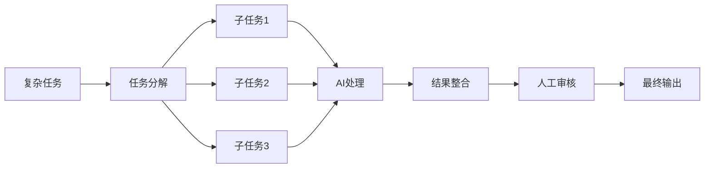

# 效率提升技巧

> "效率不是做更多的事，而是做对的事。" —— 彼得·德鲁克

## 概述

本章汇总了使用 AI 提升工作效率的核心技巧、最佳实践和进阶方法。掌握这些技巧，你将能够更高效地利用 AI 工具，让工作事半功倍。

## 提示词技巧

### 1. 结构化提示词

使用结构化的提示词可以获得更精准的输出：

```markdown
# 角色
你是一位[专业角色]，拥有[相关经验]。

# 任务
请帮我[具体任务]。

# 要求
1. [要求1]
2. [要求2]
3. [要求3]

# 格式
请按以下格式输出：
[格式说明]

# 示例
参考示例：
[示例内容]

# 背景
[补充背景信息]
```

**示例**:

```markdown
# 角色
你是一位资深产品经理，拥有10年互联网产品经验。

# 任务
请帮我设计一个用户增长方案。

# 要求
1. 方案需要具体可执行
2. 包含关键指标和预期效果
3. 考虑资源限制

# 格式
请按以下格式输出：
## 方案概述
## 具体措施
## 关键指标
## 预期效果
## 资源需求

# 背景
产品：一款健身APP
现状：DAU 10万，月增长5%
目标：3个月内DAU达到20万
预算：50万
```

### 2. 迭代优化技巧

通过多轮对话逐步优化结果：

```markdown
# 第一轮：获取初稿
请帮我写一份项目计划书...

# 第二轮：优化内容
这个计划书太笼统了，请补充具体的里程碑和时间节点...

# 第三轮：调整风格
语气太正式了，请改得更轻松一些...

# 第四轮：完善细节
请增加风险应对措施...
```

### 3. 角色设定技巧

让 AI 扮演特定角色，获得更专业的输出：

```markdown
# 专家角色
你是一位[领域]专家，请从专业角度分析...

# 批评者角色
你是一位严格的审稿人，请指出以下内容的问题...

# 用户角色
你是一位[类型]用户，请评估这个产品的优缺点...

# 竞争对手角色
你是一家竞争公司的产品经理，请分析我们的产品...
```

### 4. 思维框架应用

使用经典思维框架引导 AI 思考：

```markdown
# SWOT 分析
请用 SWOT 分析框架分析[主题]...

# 5W2H 分析
请用 5W2H 方法分析[问题]...
- What：是什么
- Why：为什么
- Who：谁
- When：何时
- Where：何地
- How：怎么做
- How much：多少

# 金字塔原理
请用金字塔原理组织以下内容...

# 第一性原理
请从第一性原理出发分析[问题]...
```

---

## 提示词模板库

### 日常办公

#### 邮件撰写

```markdown
请帮我写一封邮件：

收件人：[角色/姓名]
主题：[邮件主题]
目的：[邮件目的]
语气：[正式/友好/紧急]
关键信息：
- [信息1]
- [信息2]
- [信息3]

要求：简洁明了，不超过200字
```

#### 会议纪要

```markdown
请根据以下会议记录生成会议纪要：

会议主题：[主题]
时间：[时间]
参会人员：[人员]

会议内容：
[记录内容]

要求：
1. 格式规范，结构清晰
2. 突出决议和待办
3. 标注责任人和时间
```

#### 工作总结

```markdown
请帮我写一份工作总结：

时间范围：[周/月/季度]
主要工作：
- [工作1]
- [工作2]
- [工作3]

成果：
- [成果1]
- [成果2]

问题与改进：
- [问题1]
- [改进措施1]

要求：结构清晰，数据支撑
```

### 内容创作

#### 文章大纲

```markdown
请为以下主题设计文章大纲：

主题：[主题]
目标读者：[读者画像]
字数：[字数]
风格：[风格]

要求：
1. 逻辑清晰
2. 层次分明
3. 每个部分有核心观点
```

#### 文案创作

```markdown
请帮我撰写文案：

产品/服务：[描述]
目标用户：[用户画像]
核心卖点：[卖点列表]
使用场景：[场景]
字数：[字数]
风格：[风格]

要求：吸引人、有说服力
```

### 学习研究

#### 知识梳理

```markdown
请帮我梳理[主题]的知识体系：

要求：
1. 核心概念及定义
2. 主要理论/方法
3. 应用场景
4. 学习路径
5. 推荐资源
```

#### 文献总结

```markdown
请总结以下文献：

[文献内容或摘要]

要求：
1. 研究问题
2. 研究方法
3. 主要发现
4. 研究贡献
5. 局限性
```

---

## 工作流优化

### 1. 任务分解流程

将复杂任务分解为 AI 可处理的小任务：



**示例**：撰写一份市场调研报告

1. **分解任务**
   - 行业背景调研
   - 竞品分析
   - 用户调研
   - 数据分析
   - 报告撰写

2. **AI 处理**
   - AI 收集行业信息
   - AI 分析竞品
   - AI 整理用户反馈
   - AI 分析数据

3. **人工整合**
   - 审核 AI 输出
   - 补充专业判断
   - 整合最终报告

### 2. 批量处理技巧

将相似任务批量处理，提高效率：

```markdown
# 批量翻译
请将以下内容批量翻译成中文：

1. Hello World
2. Good Morning
3. Thank You
...

请用表格形式输出，包含原文和译文。

# 批量生成
请为以下产品生成产品描述：

产品列表：
1. 智能手表
2. 无线耳机
3. 便携充电器

每个描述100字左右，突出产品特点。
```

### 3. 模板复用

建立个人提示词模板库，避免重复劳动：

```markdown
# 个人模板库结构

## 日常办公
- 邮件模板
- 会议纪要模板
- 工作总结模板
- 项目计划模板

## 内容创作
- 文章大纲模板
- 文案创作模板
- 社交媒体模板

## 学习研究
- 知识梳理模板
- 文献总结模板
- 学习计划模板
```

---

## 进阶技巧

### 1. 多 AI 协作

不同 AI 工具各有所长，可以组合使用：

```markdown
# 协作流程示例

## 第一步：信息收集
使用 Perplexity 搜索最新资料

## 第二步：内容生成
使用 ChatGPT/Claude 生成初稿

## 第三步：内容优化
使用 Kimi 处理中文优化

## 第四步：格式整理
使用 AI 辅助排版和格式化
```

### 2. 上下文管理

有效管理对话上下文，提高 AI 理解准确度：

```markdown
# 建立上下文

## 项目背景
我正在做一个[项目描述]，目标是[目标]。

## 当前阶段
目前处于[阶段]，已完成[已完成内容]。

## 当前任务
现在需要[具体任务]。

## 相关信息
[补充信息]

# 保持上下文
在后续对话中，定期总结和重申关键信息。
```

### 3. 输出控制

精确控制 AI 输出格式和内容：

```markdown
# 格式控制

## 表格输出
请用表格形式输出，包含以下列：
| 列1 | 列2 | 列3 |
|-----|-----|-----|
| ... | ... | ... |

## JSON 输出
请用 JSON 格式输出：
```json
{
  "key1": "value1",
  "key2": "value2"
}
```

## 列表输出

请用有序列表输出：

1. 内容1
2. 内容2
3. 内容3

## 字数控制

请控制在[字数]字以内。

### 4. 质量保证

确保 AI 输出质量的技巧：

```markdown
# 质量检查清单

## 事实核查
- [ ] 关键数据是否准确
- [ ] 引用来源是否可靠
- [ ] 时间信息是否正确

## 逻辑检查
- [ ] 论点是否清晰
- [ ] 论据是否充分
- [ ] 结论是否合理

## 语言检查
- [ ] 语法是否正确
- [ ] 表达是否流畅
- [ ] 风格是否一致

## 格式检查
- [ ] 格式是否规范
- [ ] 结构是否清晰
- [ ] 排版是否整齐
```

---

## 常见问题解决

### 1. AI 输出太泛泛

**问题**: AI 输出内容空洞，缺乏具体细节

**解决方案**:

```markdown
# 提供更多上下文
请结合以下背景信息撰写...
[详细背景]

# 要求具体细节
请在内容中加入具体的数据、案例、时间等细节...

# 指定深度
请从[角度]深入分析，不要泛泛而谈...

# 提供示例
请参考以下示例的风格和深度：
[示例内容]
```

### 2. AI 不理解意图

**问题**: AI 输出与期望不符

**解决方案**:

```markdown
# 明确说明期望
我期望的输出是...，而不是...

# 提供示例
请参考以下示例：
[示例]

# 分步骤指导
让我们分步骤来完成：
第一步：...
第二步：...

# 重新描述
让我重新描述一下需求...
```

### 3. AI 输出格式混乱

**问题**: 输出格式不符合要求

**解决方案**:

```markdown
# 明确格式要求
请严格按照以下格式输出：
[格式模板]

# 使用分隔符
请用"---"分隔不同部分。

# 提供格式示例
请按以下格式输出：
示例：
标题：xxx
内容：xxx
总结：xxx
```

### 4. AI 信息不准确

**问题**: AI 输出包含错误信息

**解决方案**:

```markdown
# 要求标注不确定信息
如果不确定，请标注"待核实"...

# 提供准确信息
请基于以下准确信息进行回答：
[准确信息]

# 要求引用来源
请提供信息来源...

# 交叉验证
使用多个 AI 工具交叉验证关键信息...
```

---

## 效率工具推荐

### AI 工具组合

| 场景 | 推荐组合 | 说明 |
|------|----------|------|
| 日常写作 | Kimi + ChatGPT | 中文优化 + 综合能力 |
| 学术研究 | Perplexity + Claude | 信息检索 + 深度分析 |
| 编程开发 | ChatGPT + Claude | 代码生成 + 代码审查 |
| 数据分析 | ChatGPT + Python | 分析建议 + 代码实现 |
| 创意工作 | ChatGPT + Midjourney | 创意生成 + 视觉呈现 |

### 效率工具

| 工具 | 功能 | 说明 |
|------|------|------|
| Notion | 知识管理 | 集成 AI 功能 |
| Raycast | 快速启动 | AI 命令集成 |
| Alfred | 工作流自动化 | 自定义 AI 工作流 |
| Keyboard Maestro | 自动化 | 批量任务自动化 |
| Obsidian | 笔记管理 | 知识库管理 |

---

## 最佳实践

### 1. 建立个人工作流

```markdown
# 示例：内容创作工作流

## 第一步：灵感收集
- 使用 AI 头脑风暴
- 收集相关素材

## 第二步：大纲设计
- AI 生成大纲
- 人工调整优化

## 第三步：内容撰写
- AI 生成初稿
- 人工修改完善

## 第四步：内容优化
- AI 润色语言
- 人工审核定稿

## 第五步：格式整理
- AI 辅助排版
- 最终检查发布
```

### 2. 持续学习优化

```markdown
# 学习优化循环

1. 使用 AI 完成任务
2. 记录效果好的提示词
3. 总结失败的经验
4. 迭代优化提示词
5. 建立个人最佳实践库
```

### 3. 保持人机平衡

```markdown
# 人机协作原则

## AI 擅长
- 信息收集与整理
- 初稿生成
- 格式化输出
- 批量处理
- 语言优化

## 人类擅长
- 创意判断
- 专业决策
- 情感表达
- 价值判断
- 最终审核

## 协作原则
- AI 辅助，人类主导
- AI 生成，人类审核
- AI 建议，人类决策
```

---

## 注意事项

### 适用场景

✅ **推荐使用**:

- 重复性任务自动化
- 信息整理与汇总
- 初稿快速生成
- 格式化输出
- 多语言处理

⚠️ **谨慎使用**:

- 需要专业判断的内容
- 涉及敏感信息的任务
- 需要高度原创的创作
- 重要决策依据

❌ **不建议使用**:

- 完全依赖 AI 不审核
- 涉及法律责任的内容
- 需要人际沟通的任务
- 需要实地调研的工作

### 效率陷阱

1. **过度依赖**: 不要事事都问 AI，保持独立思考
2. **完美主义**: AI 输出不可能完美，适度即可
3. **工具切换**: 频繁切换工具反而降低效率
4. **忽视学习**: 要学习 AI 的能力边界和最佳实践

---

## 参考资料

- 《提示工程指南》- OpenAI
- 《高效能人士的七个习惯》- 史蒂芬·柯维
- 《深度工作》- 卡尔·纽波特
- [Learn Prompting](https://learnprompting.org)
- [OpenAI Documentation](https://platform.openai.com/docs)
